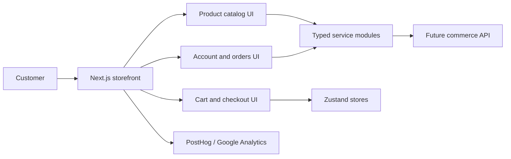

<h1 align="center">Lensora</h1>

<p align="center">
  <strong>Premium eyewear commerce storefront for prescription glasses, sunglasses, and optical accessories.</strong>
  <br />
  <em>A Next.js retail frontend foundation focused on product discovery, mobile-first browsing, checkout readiness, and a crisp gallery-style design system.</em>
</p>

<p align="center">
  <a href="#quick-start"></a>
  <a href="#storefront-plan"></a>
  
  
  
  
  
</p>

---

**Buying eyewear online should make shape, fit, prescription needs, price, and style easy to compare without burying products under noisy interface chrome.**

Lensora is a modern e-commerce storefront foundation for an optical retailer. The project pairs a Next.js 15 frontend shell with a documented architecture for product catalog pages, cart and checkout flows, customer accounts, search, filters, analytics, and future eyewear-specific features like virtual try-on and prescription upload.

The current brand metadata targets **Kính thuốc Anh Thi** as a Vietnamese optical store. The visual direction follows a sharp, high-contrast luxury catalog style: white space, black typography, square edges, no shadows, and product imagery as the main signal.

> Current status: this repository contains the frontend scaffold, architecture notes, and design system reference. Storefront pages, shared UI components, services, stores, and backend APIs are planned but not yet implemented.

---

## Features

<table>
  <tr>
    <td width="50%" valign="top">
      <h3>Eyewear storefront architecture</h3>
      <p>Planned routes cover home, shop, eyeglasses, sunglasses, collections, product detail, cart, checkout, account, orders, about, contact, and FAQ views.</p>
    </td>
    <td width="50%" valign="top">
      <h3>Product discovery model</h3>
      <p>The frontend plan includes product cards, grids, galleries, product info, pricing, reviews, related products, and filters for catalog browsing.</p>
    </td>
  </tr>
  <tr>
    <td width="50%" valign="top">
      <h3>Cart and checkout foundation</h3>
      <p>Cart item, cart summary, checkout form, and order summary components are defined as the core purchasing flow for implementation.</p>
    </td>
    <td width="50%" valign="top">
      <h3>Minimal luxury design system</h3>
      <p>The design reference uses a monochrome palette, square controls, strong typography, generous white space, and image-led product presentation.</p>
    </td>
  </tr>
  <tr>
    <td width="50%" valign="top">
      <h3>State and service boundaries</h3>
      <p>Planned Zustand stores cover cart, wishlist, user, and UI state. Service modules separate products, cart, checkout, customer, and search behavior.</p>
    </td>
    <td width="50%" valign="top">
      <h3>Growth-ready roadmap</h3>
      <p>Future features include virtual try-on, face shape analysis, AI recommendations, prescription upload, loyalty, gift cards, and a mobile app.</p>
    </td>
  </tr>
</table>

---

## Quick Start

### 1. Install frontend dependencies

```bash
cd frontend
npm install
```

### 2. Run the development server

```bash
npm run dev
```

Open:

- Storefront dev server: `http://localhost:3000`

The current scaffold is intended for implementation work. Before treating the app as a complete storefront, add the first route page and the global stylesheet imported by `frontend/src/app/layout.tsx`.

---

## Tech Stack

| Layer | Stack |
| --- | --- |
| Frontend | Next.js 15, React 19, TypeScript |
| Styling | Tailwind CSS 4, class-variance-authority, clsx, tailwind-merge |
| UI direction | shadcn/ui conventions, Radix UI patterns, Lucide icons |
| State | Zustand |
| Animation | Framer Motion |
| Planned data layer | TanStack Query, typed service modules |
| Planned forms | React Hook Form, Zod |
| Planned analytics | PostHog, Google Analytics |

---

## Project Structure

```text
.
├── DESIGN_SYSTEM.md        # Visual system reference for the storefront
├── FRONTEND.md             # Frontend architecture, pages, components, and roadmap
├── backend                 # Reserved for future API/backend work
└── frontend
    ├── package.json        # Frontend scripts and dependencies
    ├── next.config.ts      # Next.js configuration
    ├── postcss.config.mjs  # Tailwind CSS PostCSS integration
    ├── tsconfig.json       # TypeScript configuration
    └── src/app/layout.tsx  # Root app layout and metadata
```

Planned frontend structure from `FRONTEND.md`:

```text
src/
├── app/
├── components/
│   ├── ui/
│   ├── layout/
│   ├── product/
│   ├── cart/
│   └── marketing/
├── services/
├── stores/
├── hooks/
├── lib/
├── types/
└── styles/
```

---

## Configuration

The current frontend shell does not require runtime environment variables.

Recommended future environment variables for planned analytics integrations:

| Variable | Description |
| --- | --- |
| `NEXT_PUBLIC_POSTHOG_KEY` | Public PostHog project key. |
| `NEXT_PUBLIC_POSTHOG_HOST` | Optional PostHog host override. |
| `NEXT_PUBLIC_GA_MEASUREMENT_ID` | Google Analytics measurement ID. |

Store local frontend overrides in:

```text
frontend/.env.local
```

---

## How It Works



1. The storefront presents product-led browsing for eyewear categories, collections, and product detail pages.
2. Shared product, cart, marketing, and layout components keep the shopping experience consistent across routes.
3. Zustand stores hold client-side cart, wishlist, user, and UI state.
4. Service modules isolate product, cart, checkout, customer, and search data access.
5. Future backend APIs can plug into the service layer without coupling the UI to transport details.

---

## Storefront Plan

| Area | Planned surface |
| --- | --- |
| Catalog | Home, shop, eyeglasses, sunglasses, collections, product detail, related products |
| Shopping | Wishlist, cart, checkout, order summary |
| Customer | Account, orders, order tracking |
| Content | About, contact, FAQ, newsletter, testimonials |
| Search | Product search, category filters, product filters |
| Future eyewear tools | Virtual try-on, face shape analysis, prescription upload, AI recommendations |

---

## Design System

The design reference in `DESIGN_SYSTEM.md` is built around a high-end gallery retail aesthetic.

| Token group | Direction |
| --- | --- |
| Color | White background, black primary text, restrained grays for hierarchy |
| Typography | Clean sans-serif scale for captions, body, subheadings, and headings |
| Shape | `0px` radius across cards, inputs, and buttons |
| Elevation | No shadows; hierarchy comes from spacing, contrast, and imagery |
| Imagery | Product and model photography should dominate the layout |

Implementation rules to preserve:

- Keep controls square and minimal.
- Avoid gradients, shadows, and decorative color accents.
- Use product imagery as the primary visual content.
- Keep navigation and product metadata concise.

---

## Backend Status

The `backend/` directory is currently empty and reserved for future API work.

Expected backend responsibilities when implemented:

- Product catalog and inventory data.
- Customer accounts and order history.
- Cart, checkout, and payment orchestration.
- Review and rating persistence.
- Search and recommendation endpoints.

---

## Scripts

Run scripts from the `frontend/` directory.

| Command | Description |
| --- | --- |
| `npm run dev` | Start the Next.js development server. |
| `npm run build` | Build the frontend for production. |
| `npm run start` | Start the production Next.js server after a build. |
| `npm run typecheck` | Run TypeScript without emitting files. |

---

## Verification

Run these checks before shipping frontend changes:

```bash
cd frontend
npm run typecheck
npm run build
```

If the app shell is still incomplete, add the missing route and stylesheet files before expecting a production build to pass.

<p align="center">
  <strong>Make premium eyewear browsing clear, sharp, and easy to buy from.</strong>
</p>
